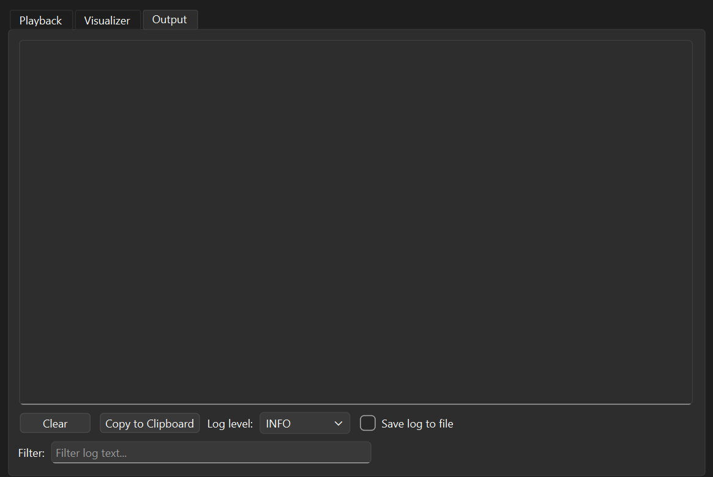

# Jukebox 🎹

[](https://python.org)
[](https://github.com/x15rte/Jukebox/blob/main/LICENSE)
[](https://discord.gg/jaxgETk5Em)  
MIDI to Roblox Piano !  

Supports Windows, macOS, and Linux  

# 🚀 Usage 
## Method 1 (Recommend)
```bash
# Install
git clone https://github.com/x15rte/Jukebox.git
cd Jukebox/
sudo apt install libasound2-dev libjack-dev (Linux)
pip install -r ./requirements.txt (Mac/Linux)
pip install -r ./requirements-windows.txt (Windows)

# Run
python ./main.py

# Update
git pull
```
## Method 2  
Download and run the latest release from the [Releases page](https://github.com/x15rte/Jukebox/releases).

# 💡 Tips 
Use MIDI output to support velocity  
KEY Mode: 88-Key -> Ctrl    
Pedal -> Space  

Open config dir  
`cd ~/.jukebox_piano/`

# 📦 Freeze to exe 
```bash
pyinstaller ./Jukebox.spec
```

# 📸 Screenshots 





